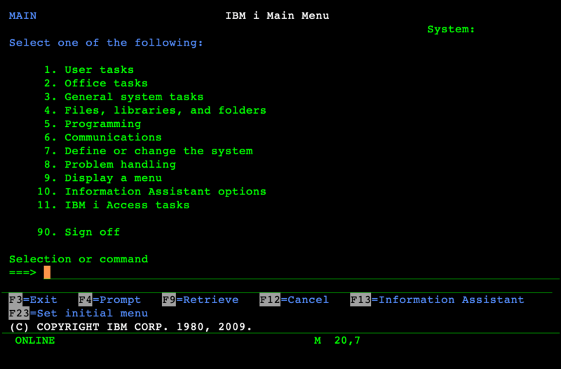
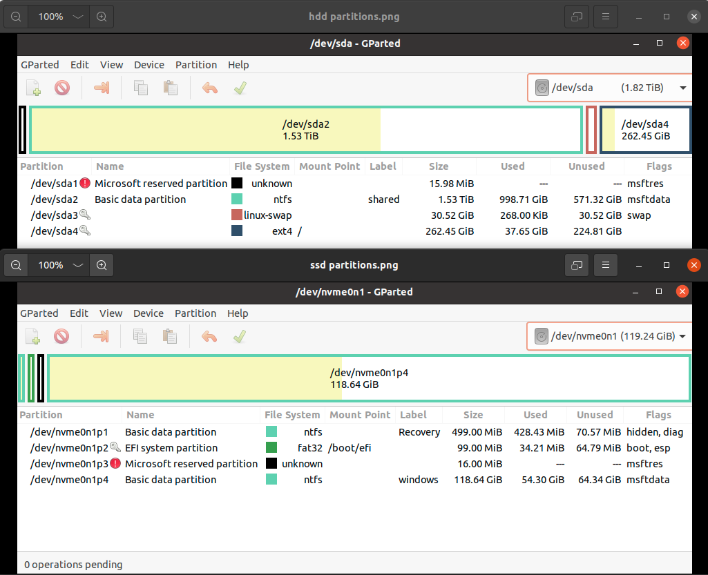
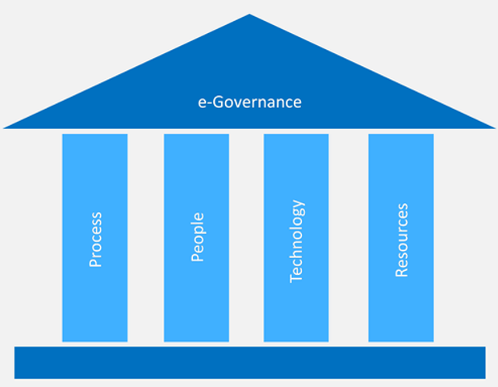

### Namaste :pray:  

🌱 I started these repositories for solving problems one para at a time.   

✨ Share, cite, or reference these pages - the homepage or specific repo.    

> @misc{rks101,
  author = {RKS},
  title = {GitHub repo at rks101},
  howpublished = {\url{https://github.com/rks101 }},
  note = {Add note},
  year = {2018-2024}
}

🌱 For any error, oversight, or obsolete references, 💬 let me know how to improve the content.    

> _“I don’t know what’s the matter with people: they don’t learn by understanding; they learn by some other way—by rote or something. Their knowledge is so fragile!”_     
— Richard Feynman    

🌱 Human Intelligence is essential. Human touch should remain alive with software, security, automation, or programmed devices.     

<!--
🔭 Also, I’m currently learning "Selected Topics in Cognitive and Behavioural Science" - especially the kinds of systematic biases or challenges we live with.     

**rks101/rks101** is a ✨ _special_ ✨ repository because its `README.md` (this file) appears on your GitHub profile.

Here are some ideas to get you started:

- 🔭 I’m currently working on ...
- 🌱 I’m currently learning ...
- 👯 I’m looking to collaborate on ...
- 🤔 I’m looking for help with ...
- 💬 Ask me about ...
- 📫 How to reach me: ...
- ⚡ Fun fact: ...
-->

### Skills

 
    <!-- https://www.bell-labs.com/usr/dmr/www/cman.pdf -->
     
     
     
     
     
     
     
     
     
     
     
     
     
    
    

     
    
    
    

 

<!---->
