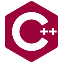
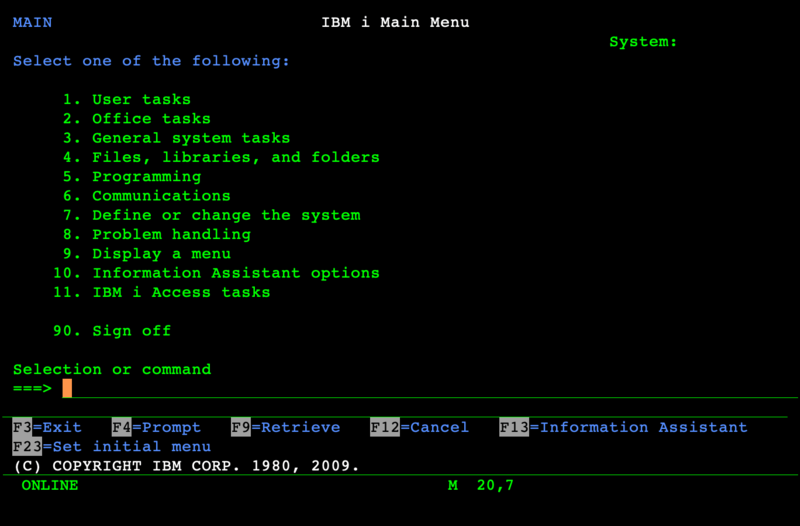
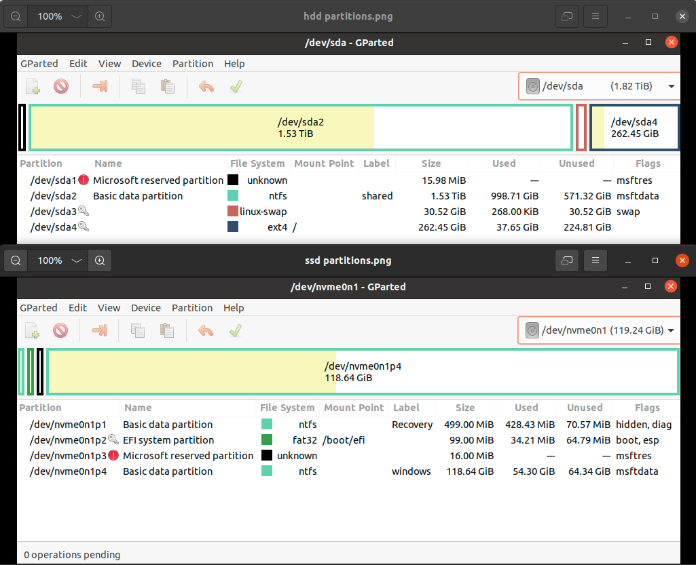
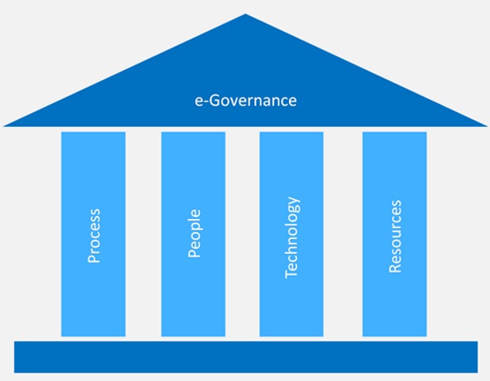

### Namaste :pray:  

🌱 I started these pages and repositories for solving problems one para at a time. These are, mostly, my notes to refer them back anytime!    

💚 Everything that needs to be said has already been said. Since, some of us were not listening or reading, everything must be said again! 😄    

🌱 For errors, oversight, or obsolete references, 💬 let me know how to improve the content.    

🌱 Human Intelligence is essential. Human touch should remain alive with software, security, or automation.     

🐧🐧🐧 To make penguins happy, please share, cite, or reference these pages - the homepage, rks101, or a specific repo.   

@misc{rks101,
  author = {rks},
  title = {GitHub repos at rks101},
  howpublished = {\url{https://github.com/rks101}},
  note = {Notes by rks},
  year = {2018-2026}
}

@misc{rks101-eglinux,
  author = {rks},
  title = {GitHub repo eglinux},
  howpublished = {\url{https://github.com/rks101/eglinux}},
  note = {Helpful Linux discussions},
  year = {2018-2026}
} 

@misc{rks101-egnet,
  author = {rks},
  title = {GitHub repo egnet},
  howpublished = {\url{https://github.com/rks101/egnet}},
  note = {Helpful Networking discussions},
  year = {2018-2026}
} 

@misc{rks101-isdp,
  author = {rks},
  title = {GitHub repo isdp},
  howpublished = {\url{https://github.com/rks101/isdp}},
  note = {Helpful discussions on Information Security and Data Protection},
  year = {2018-2026}
} 

🔭 Currently working on ... webapps because Some portals in our country need love!    
👯 Looking forward to collaborate on these repos ...    

<!--
- 🌱 learning ...
- 🤔 looking for help with ...
- 💬 correct/feedback about ...
- 📫 reach me: ...
- ⚡ Fun fact: ...
-->

<!--
### Privacy Disclosure 

It does not and will not collect or use your data.   
Your visits, submitted data (if any), are:   
- Not being sold to third parties, no exceptions.   
- Not being used or transferred for unintended purposes.   
-->

<!--
### Skills

 
                             

     
    
    
    
     

-->

<!-- THM profile -->
<!--<iframe src="https://tryhackme.com/api/v2/badges/public-profile?userPublicId=1920690" style='border:none;'></iframe> --> 

<!---->
